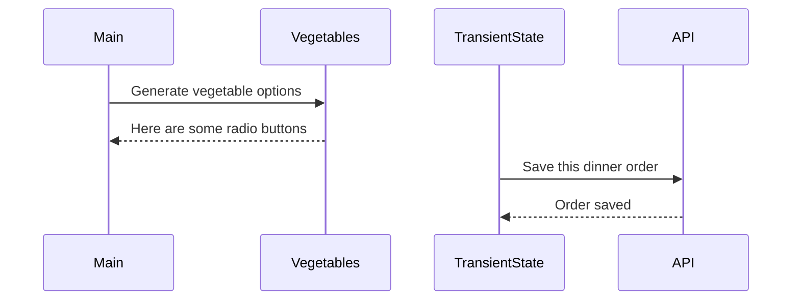

# Events and State Self-Assessment

## Setup

1. Make sure you are in your `workspace` directory
1. `git clone {github repo SSH string}`
1. `cd` into the directory it creates
1. `code .` to open the project code
1. Use the `serve` command to start the web server
1. Open the URL provided in Chrome

## Requirements

### Initial Render

1. All 10 base dishes should be displayed as radio input options.
1. All 9 vegetables should be displayed as radio input options.
1. All 6 side dishes should be displayed as radio input options.
1. All previously purchases meals should be displayed below the meal options. Each purchase should display the primary key and the total cost of the purcahsed meal.

### State Management

1. When the user selects an item in any of the three columns, the choice should be stored as transient state.
1. When a user makes a choice for all three kinds of food, and then clicks the "Purchase Combo" button, a new sales object should be...
    1. Stored as permanent state in your local API.
    1. Represented as HTML below the **Monthly Sales** header in the following format **_exactly_**. Your output will not have zeroes, but the actual amount.
        ```html
        Receipt #1 = $00.00
        ```
   1. The user's choices should be cleared from the database state once the purchase is made.

## Design

Given the description and animation above...

1. Create an ERD for this application before you begin.
1. Make a list of what modules need to be created to make your application as modular as possible. Create a **Dependency Graph** for the project to be reviewed once you are complete with the assessment.
1. Create a **Sequence Diagram** that visualizes what your algorithm is for this project. We'll give you a minimal starting point.


